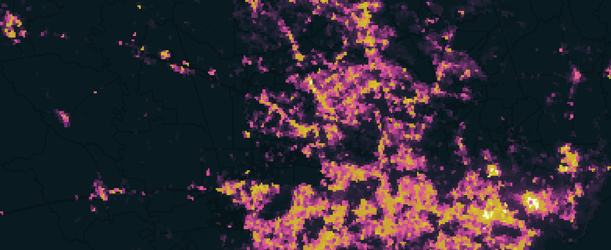

*UCSB MEDS* - *EDS 223 - Geospatial Analysis &amp; Remote Sensing*


# Houston Night Lights

     

**Author:** Nicole Pepper

<div style="text-align: left;">
  

### About the Repo:

[This repository](https://github.com/nicolelpepper/aquaculture-habitat-suitability) contains a R-Studio Quarto Markdown document of my analysis exploring the impact of a severe weather event in 2021 on Houston, Texas, which caused widespread power outages throughout the region. I use NASA Visible Infrared Imaging Radiometer Suite (VIIRS) nighttime imagery to detect night lights to compare the intensity of night lights before and after the first major storm. I also overlaid the imagery with census tract data containing information on the median household income to explore the distribution of household income for areas that experienced a power outage.

### Technical Highlights:
- Programming in R
- Vector data wrangling with `sf`
- Raster data wrangling with `terra` and `stars`
- Data visualization with `tmap` and `ggplot`

### Data Descriptions:

- The `Night Light Imagery` data is a collection of raster files containing the nighttime light intensity for the Houston area. It is from NASA  Visible Infrared Imaging Radiometer Suite (VIIRS). VIIRS data is distributed through [NASA’s Level-1 and Atmospheric Archive & Distribution System Distributed Active Archive Center (LAADS DAAC)](https://ladsweb.modaps.eosdis.nasa.gov/). There are 4 tiles stored as `.tifs`, two tiles to cover the Houston area before and after the storm. The data was accessed locally.

- The `Roads` dataset contains roadways for the Houston Metro Area. The data is a subset of roads from OpenStreetMap (OSM) that intersect with Houston, prepared by Geofabrik [Geofabrik](https://download.geofabrik.de/). It was stored by a geopackage, the data was accessed locally.

- The `Buildings` dataset contains polygons for buildings in the Houston Metro Area. The data is a subset of buildings from OpenStreetMap (OSM) that fall within the Houston Metro Area, prepared by [Geofabrik](https://download.geofabrik.de/). It was stored by a geopackage, the data was accessed locally.

- The `Socioeconomics` data contains socioeconomic information for every home, by census tract, in the Houston Metro Area. The data is a subset of census data from the [U.S. Census Bureau’s American Community Survey](https://www.census.gov/programs-surveys/acs) for census tracts in 2019. It was stored as an Esry file geodatabase.

### Repo structure:
*Note that the data was not pushed to GitHub*

```
houston-night-lights
│   README.md
│   Rmd/Proj files    
│
└───data
    │   gis_osm_buildings_a_free_1.gpkg
    │   gis_osm_roads_free_1.gpkg
    │
    └───ACS_2019_5YR_TRACT_48_TEXAS.gdb
    |   │   census tract gdb files
    |
    └───VNP46A1
    |   │   VIIRS data files

```

### References:

- [NASA](https://planet.openstreetmap.org/) VIIRS Level-1 and Atmospheric Archive & Distribution Active Archive Center. Night Light Imagery for February 7, 2021, and February 16, 2021. [Data] *Access date: 11/15/24*

- [Open Street Map (OSM)](https://planet.openstreetmap.org/) OSM Roads Free, Year Unknown [Data] *Access date: 11/15/24*

- [Open Street Map (OSM)](https://planet.openstreetmap.org/) OSM Buildings A Free, Year Unkown [Data] *Access date: 11/15/24*


- [US Census Bureau's American Community Survey](https://www.census.gov/programs-surveys/acs) ACS 2019 5YR Tract 48, 2019 [Data] *Access date: 11/15/24*

### Acknowledgments:
This assignment was created by Ruth Oliver, EDS 223 - Fall 2024 Instructor.
